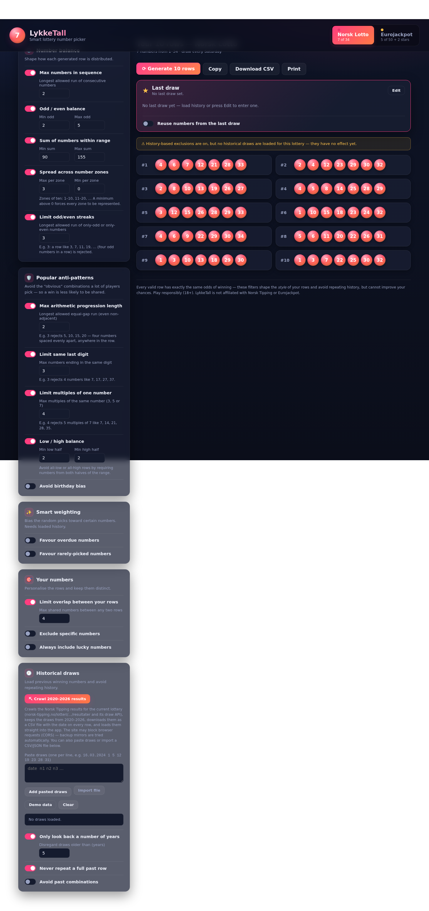

# LykkeTall — Smart Lottery Number Picker

A professionally designed, dependency-free web app that picks **10 sets of lottery numbers**
for **Norsk Lotto** (7 of 34) or **Eurojackpot** (5 of 50 + 2 star numbers of 12),
with configurable selection criteria and history-aware exclusions.

## Running

No build step and no dependencies. Either:

- open `index.html` directly in a browser, or
- serve the folder statically, e.g. `python3 -m http.server 8000` and visit
  `http://localhost:8000`.

## Features

### Lottery systems
Switch between **Norsk Lotto** and **Eurojackpot** with the segmented control in the
header. Each system keeps its own rules, sum-range defaults, theme colour and
loaded history.

### Historical draws
Load previously drawn winning numbers and stop the generator from repeating history:

- **Crawl 2020–2026 results** — crawls the Norsk Tipping results for the current
  lottery (`norsk-tipping.no/lotteri/{lotto,eurojackpot}/resultater` and the draw
  API behind them, walking backwards draw by draw until it passes 2020), keeps the
  draws from 2020–2026, downloads them as a CSV file (`date,n1,…` — one dated row
  per draw) and loads them straight into the app. Requests try the site directly
  and fall back to public read-through mirrors when blocked by CORS.
- **Paste draws** — one draw per line, e.g. `16.03.2024 1 5 12 19 23 28 31`
  (Eurojackpot: `14.06.2024 7 19 28 33 45 + 3 9`). Norwegian (`dd.mm.yyyy`) and ISO
  dates are both understood.
- **Import file** — CSV/TXT (line-oriented, same format as paste) or JSON
  (`[{date, mains, stars}]` and several common API shapes).
- **Demo data** — synthetic draws, clearly labelled, for trying out the filters.

History controls:

- **Only look back a number of years** — disregard draws older than *N* years.
- **Never repeat a full past row** — generated rows must not match any historical row.
- **Avoid past combinations** — reject any row containing a previously drawn group of
  *k* numbers (e.g. with *k* = 4: if 3, 9, 17 and 25 ever appeared together, no
  generated row may contain all four).

A statistics panel shows per-number frequency and hot/cold numbers for the active window.

### Last draw & reuse
A highlighted **Last draw** card (gold-ringed balls) shows the most recent draw — the
newest dated row in your history, or one you type in yourself via **Edit**. A dual-thumb
**reuse** slider then lets each generated row carry over a chosen *range* of numbers from
that last draw — e.g. exactly 0, 0–1, 0–2, 1–3, … up to all of them. The carried-over
numbers are highlighted in gold in every generated row, with a `↻ N` badge showing how
many were reused. Reuse is enforced structurally (not by trial and error), so even high
reuse counts generate instantly.

### Selection criteria (each one can be toggled)

| Criterion | What it does |
|---|---|
| Max numbers in sequence | Limits the longest run of consecutive numbers (e.g. allow at most 2) |
| Odd / even balance | Requires between *min* and *max* odd numbers per row |
| Sum within range | Keeps each row's sum inside a configurable band (defaults per lottery) |
| Spread across number zones | Between *min* and *max* numbers per zone of ten (1–10, 11–20, …); a minimum above 0 forces every zone to be represented |
| Limit odd/even streaks | Rejects rows containing more than *N* consecutive only-odd or only-even numbers (e.g. 3, 7, 11, 19) |
| **Max arithmetic progression length** | Rejects rows whose numbers contain an equal-gap run longer than *N* — even non-adjacent, so 5, 10, 15, 20 hiding in a row is caught |
| Limit same last digit | Rejects rows with more than *N* numbers ending in the same digit (7, 17, 27, 37) |
| Limit multiples of one number | Rejects rows with more than *N* multiples of the same small number (3, 5 or 7) |
| Low / high balance | Requires at least *minLow* numbers from the low half and *minHigh* from the high half — no all-low or all-high rows |
| Avoid birthday bias | Requires at least one number above 31 (fewer co-winners if you win) |
| Favour overdue numbers (slider) | Raises the sampling weight of numbers that have gone longest without being drawn within the lookback window — up to 9× at 100 % |
| Favour rarely-picked numbers (slider) | Raises the sampling weight of the numbers drawn least often within a user-chosen period (in years) — up to 9× at 100 % |
| Limit overlap between rows | No two of your 10 rows share more than *N* numbers |
| Exclude specific numbers | Numbers that must never be picked |
| Always include lucky numbers | Numbers forced into every row |

The criteria are grouped into clearly labelled panels — **Number balance**, **Popular
anti-patterns**, **Smart weighting**, **Your numbers** and **Historical draws** — each a
toggle plus its own settings.

The two sliders are sampling *biases* rather than filters: they use weighted
sampling without replacement, so boosted numbers become more likely to be
suggested while every valid row remains possible. Both need loaded history, and
the statistics panel shows the corresponding hot/cold/overdue numbers.

If the hard exclusions make the style criteria unsatisfiable, the generator relaxes
the style rules for that row (never the exclusions) and flags the row as *relaxed*.
Infeasible combinations of settings are detected and reported instead of looping.

### Output
Rows are rendered as lottery balls and can be **copied**, **downloaded as CSV** or
**printed** (a print stylesheet renders clean black-on-white tickets). Settings and
loaded history persist in `localStorage`.

## Implementation notes

- Random numbers come from `crypto.getRandomValues` with rejection sampling (no
  modulo bias).
- Generation is rejection sampling against the enabled criteria with a per-row
  attempt budget; history exclusion uses precomputed sets of full rows and
  *k*-combinations for O(1) lookups.
- The logic (`js/util.js`, `js/history.js`, `js/generator.js`, `js/lotteries.js`) is
  DOM-free and unit-tested: `node test/run-tests.js`.

## Fair-play disclaimer

Every valid row has exactly the same probability of winning. The criteria shape the
*style* of your rows and avoid repeating history; they cannot improve your odds.
Play responsibly (18+). LykkeTall is not affiliated with Norsk Tipping or Eurojackpot.
